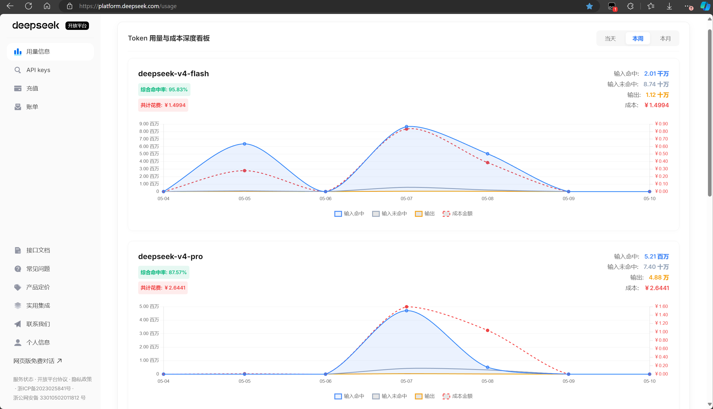
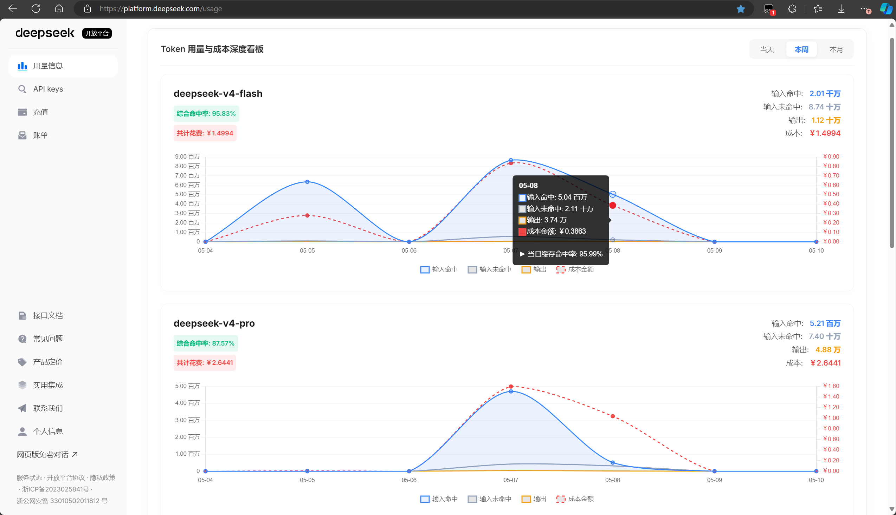
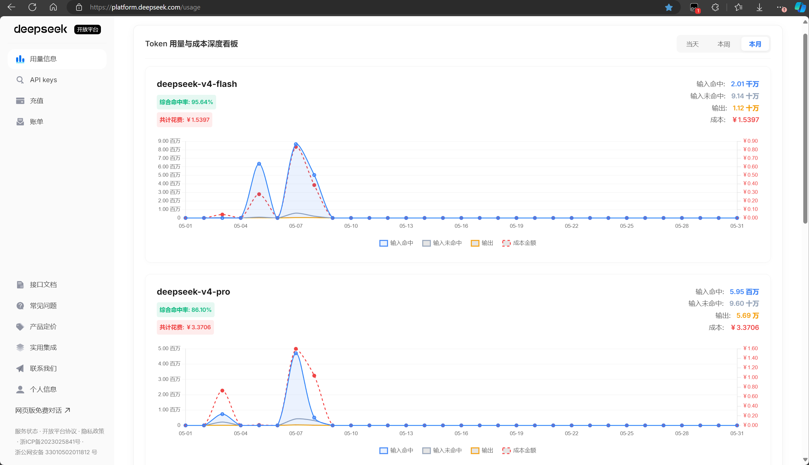

# DeepSeek 增强用量看板

一个用于提升 DeepSeek 开放平台 Token 用量与成本可视化体验的 Tampermonkey（油猴）脚本。通过纯前端底层网络请求劫持，无感重构官方数据，为你提供极简、直观、数据丰满的本地看板。

## 核心特性

* **双 Y 轴融合可视化**：打破官方用量图显示过于分散且不直观的痛点。左侧 Y 轴负责 Token 曲线，右侧 Y 轴专门绘制红色成本虚线，用量与花费一目了然。
* **严苛的阶梯式中文单位**：彻底告别冗长的数字后缀。独创智能进位算法，精准适配 `原数字 -> 万 -> 十万 -> 百万 -> 千万 -> 亿`，极致提升数据可读性。
* **多维时间跨度**：支持一键切换 `当天`、`本周`（严格按照现实世界的周一至周日计算）、`本月`。数据无缝重绘，无需刷新页面。
* **深度缓存命中分析**：不仅在卡片顶部提供当前时间跨度的综合命中率，更在图表 `Tooltip` 悬浮框内动态注入单日的精确缓存命中率计算。
* **极简毛玻璃美学**：采用全宽自适应（100% Width）卡片设计，上下两行独立展示 Flash 与 Pro 模型。配合半透明 `backdrop-filter`，优雅嵌入官方页面，不破坏原生 UI。
* **绝对的数据安全**：基于拦截原生 `fetch` 与 `XMLHttpRequest`，仅在本地读取官方响应体（Response）。零外部请求，无需授权码或 Cookie，100% 隐私安全。

## 效果展示

全宽卡片布局，Flash 与 Pro 模型独立成行，顶部徽章直观显示综合命中率与共计花费。

鼠标悬浮折线图某一天，Tooltip 精确呈现阶梯中文单位、成本金额与当日缓存命中率。

右上角时间跨度切换器，支持当天、本周（周一至周日）、本月三种模式无缝重绘。

## 安装指南

1. 确保你的浏览器已安装 **Tampermonkey（油猴）** 扩展插件。
2. 新建一个脚本，将本项目的 `script.js` 中的全部代码复制并粘贴进去。
3. 保存（Ctrl+S / Cmd+S）并启用该脚本。
4. 登录并访问 [DeepSeek 开放平台用量页面](https://platform.deepseek.com/)，即可在顶部看到全新的极简用量看板。

## 技术架构

* **注入方式**: `@run-at document-start` 确保脚本在页面渲染前初始化，零遗漏劫持。
* **网络拦截**: 双重重写 `window.fetch` 与 `window.XMLHttpRequest`，无感捕获 `/api/v0/usage/amount` 与 `/api/v0/usage/cost` 接口的 JSON 响应流。
* **图表引擎**: 采用轻量级 `Chart.js`，通过内部实例对象池管理（`chartInstances.destroy()`）防止 Canvas 内存泄漏与重绘闪烁。

## License

MIT License
